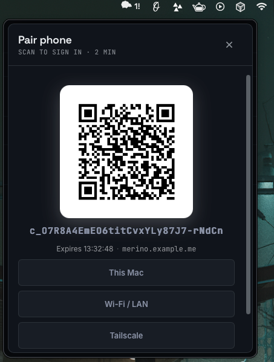
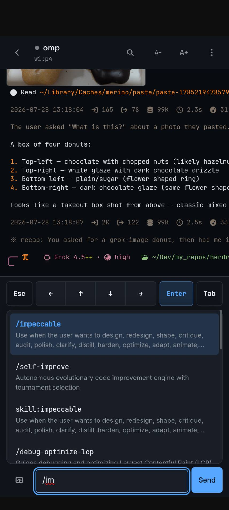

# Merino

<p align="center">
  
</p>

<p align="center">
  <strong>Menu bar + phone dashboard for <a href="https://herdr.dev">herdr</a> agents</strong><br/>
  See what’s working, what’s blocked, and answer prompts without leaving the flock.
</p>

<p align="center">
  <a href="https://github.com/LoneExile/merino/actions/workflows/ci.yml"></a>
  <a href="https://github.com/LoneExile/merino/releases/latest"></a>
  <a href="https://github.com/LoneExile/merino/blob/main/LICENSE"></a>
  <a href="https://github.com/LoneExile/merino/stargazers"></a>
  
  
</p>

---

## Why Merino

[herdr](https://herdr.dev) runs coding agents in terminal panes. Merino is the **instrument panel**:

- Live agent list (blocked first)
- Pane output streaming
- Approve / type / interrupt when you enable writes
- Phone PWA over LAN, Tailscale, or a public HTTPS tunnel
- One-shot QR pairing with revocable device grants

No CLI polling. No `herdr` subprocess. One persistent socket, push events only.

## Screenshots

<table>
  <tr>
    <td align="center" width="50%">
      <br />
      <sub><b>Menubar</b> — live agent list, blocked first</sub>
    </td>
    <td align="center" width="50%">
      <br />
      <sub><b>Pair phone</b> — QR + one-shot code, Mac / LAN / Tailscale</sub>
    </td>
  </tr>
  <tr>
    <td align="center" width="50%">
      <br />
      <sub><b>Phone pane</b> — stream + inline images like Kitty</sub>
    </td>
    <td align="center" width="50%">
      <br />
      <sub><b>Composer</b> — slash commands, attach image, send</sub>
    </td>
  </tr>
</table>


## Install

macOS **Apple Silicon** only for prebuilt binaries. Builds are **ad-hoc signed** (no Apple Developer ID / notarization yet), so install paths below clear the quarantine bit for you.

### One-liner (recommended)

```bash
curl -fsSL https://raw.githubusercontent.com/LoneExile/merino/main/scripts/install.sh | bash
```

Downloads the latest [Release](https://github.com/LoneExile/merino/releases/latest) zip, installs **Merino.app** into `/Applications`, strips Gatekeeper quarantine, and opens it. Override location with `MERINO_APP_DIR=~/Applications`.

### Manual (drag to Applications)

1. Download **Merino-\*-macos-arm64.zip** from [Releases](https://github.com/LoneExile/merino/releases/latest)
2. Unzip and drag **merino.app** → `/Applications` (rename to **Merino.app** if you like)
3. Clear quarantine, then open:

```bash
xattr -dr com.apple.quarantine /Applications/Merino.app 2>/dev/null || \
  xattr -dr com.apple.quarantine /Applications/merino.app
open /Applications/Merino.app 2>/dev/null || open /Applications/merino.app
```

If macOS still shows *“Apple could not verify…”*: **System Settings → Privacy & Security → Open Anyway**, or right-click the app → **Open**.

### Homebrew

```bash
brew tap LoneExile/merino
brew trust LoneExile/merino   # third-party tap
# Prefer --no-quarantine so Gatekeeper never tags the download:
brew install --cask --no-quarantine merino
```

The cask also installs as **Merino.app** and runs an `xattr` postflight. Upgrade: `brew update && brew upgrade --cask --no-quarantine merino`.

### Build from source

```bash
git clone https://github.com/LoneExile/merino.git
cd merino
just app          # builds Merino.app and launches it
```

Requirements: Go (see `go.mod`), Node 22+, macOS, [Wails v3](https://v3.wails.io) for packaging.

### Uninstall

One-liner (quits Merino, removes app + logs/caches/pairings):

```bash
curl -fsSL https://raw.githubusercontent.com/LoneExile/merino/main/scripts/uninstall.sh | bash
```

Keep paired devices / settings:

```bash
curl -fsSL https://raw.githubusercontent.com/LoneExile/merino/main/scripts/uninstall.sh | bash -s -- --keep-state
```

Preview only:

```bash
curl -fsSL https://raw.githubusercontent.com/LoneExile/merino/main/scripts/uninstall.sh | bash -s -- --dry-run
```

Manual:

```bash
# Quit
osascript -e 'quit app "Merino"' 2>/dev/null || true

# App (script install / drag-drop)
rm -rf /Applications/Merino.app /Applications/merino.app

# Or Homebrew
brew uninstall --cask merino 2>/dev/null || true

# Local state (audit log, device grants, bootstrap password, paste cache)
rm -rf ~/Library/Logs/merino ~/Library/Caches/merino
rm -f ~/Library/Preferences/dev.apinant.merino.plist
```

Does **not** remove [herdr](https://herdr.dev).

## Quick start

1. Install and open **Merino** (menu bar sheep).
2. Right-click the tray icon → **Pair phone…**
3. Scan the QR (or paste the code) on your phone.
4. Optional: Settings → allow session switch / password sign-in.

Phone can answer asks when **Allow phone writes** is on in Mac Settings (menubar default: on). Toggle anytime; reload the phone PWA after changing. All writes are audit-logged.

## Configuration

| Flag / env | Purpose |
| --- | --- |
| `--listen ADDR` | Web dashboard bind (e.g. `0.0.0.0:8730`) |
| `--allow-writes` | Force phone writes on (else Mac Settings / menubar default on) |
| `--allow-session-switch` | Change which herdr session the dashboard drives |
| `--behind-proxy` | Secure cookies + trust proxy headers (TLS terminator) |
| `MERINO_USER` / `MERINO_PASS` | HTTP operator credentials when listening |
| `MERINO_PUBLIC_URL` | Public origin for QR links (HTTPS recommended) |
| `MERINO_DEBUG` | Debug logging |
| `HERDR_SOCK` | herdr socket path |

State lives under `~/Library/Logs/merino/` on macOS.

```bash
export MERINO_PASS='…'
just web          # loopback dashboard
just tunnel       # LAN bind + --behind-proxy
```

## Architecture

```
herdr server (unix socket)
  ├── lifecycle connection  — global pane events
  └── status connection     — per-pane agent status
            │
         Store (Go, authoritative)
            ├── events ──▶ React panel / phone PWA
            └── tray label + sheep animation
```

**Go owns state; React projects it.** The backend emits a full sorted agent list on each change. The UI never merges deltas.

**Writes are allowlisted** in `internal/app/guard.go` before anything reaches a live terminal.

## Development

```bash
just              # list recipes
just app          # package + launch menu bar app
just gate         # local CI-ish checks
just web          # needs MERINO_PASS
```

## Brand

**Merino** — sheep mark, quiet instrument panel. Built for herdr; not a fork of herdr.

## License

[Apache-2.0](LICENSE)
